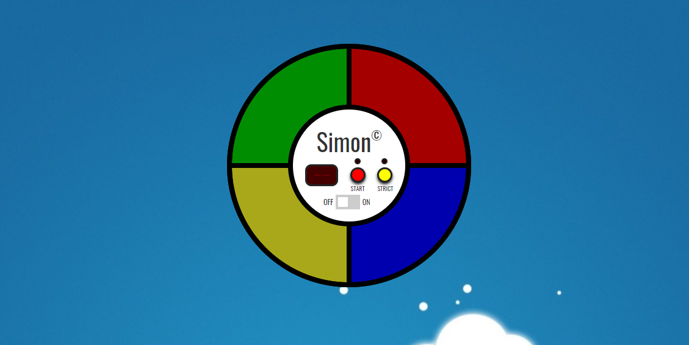

# Simon Says

Open app [here](https://play-simon-says.netlify.app/).

## Table of Contents
  - [General Information](#general-information)
  - [Installation](#installation)
  - [Usage](#usage)
  - [Game Modes](#game-modes)
  - [Strict Mode](#strict-mode)
  - [Regular Mode](#regular-mode)
  - [Status](#status)
  - [Todo](#todo)

## General Information

Simon Says is the classic kids game where the computer picks a sequence of buttons you must pick in that specific order. If the user is successful then the computer will repeat the previous sequence and add another to it for you to complete. This process will continue over and over until you make a mistake. The time allowed to complete each sequence decreases gradually over time, and the speed of the sequence will also speed up with progression too.
## Installation

If you are looking to view/make changes to the existing codebase, then cloning the repository is the best way to achieve this. 

To do this navigate to a suitable directory, and run `git clone https://github.com/jamesgower/simon-says.git` from the terminal. 

Once the repository is cloned, you can navigate to the repository and run `npm install` to install all of the dependencies. To run the application, you can run `npm run start` from the root directory, and a local version of the can be accessed from accessing http://localhost:3000 from your browser.

## Usage

To use the application, it can be accessed from 
[this](https://play-simon-says.netlify.app/) link (https://play-simon-says.netlify.app/), or by installing it with the above method.

## Game Modes
### Strict Mode
If you press the yellow "Strict" button then the game will work like a classic game of Simon Says. If you fail at any point, then the game will be reset back to its original state and you will have to start from the beginning. 

### Regular Mode

If the "Strict" button is not pressed then the game will allow you to fail as many times as you like and it will not reset you back to the beginning. You can see how far you can get without the pressure of failing. 

## Technologies

- React
- Redux
- TypeScript
- Howler
- SCSS
- CreateReactApp
- Netlify (Hosting)

## Status

The application is in a working state, but there are features which need to be implemented to be considered a finished product. Updates will be made in due course.

## Todo

Testing needs to be refactored and uploaded since refactoring and upgrading the application.
